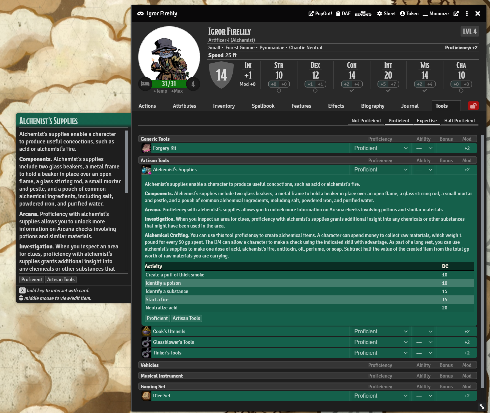

# tool-proficiencies-5e

## What it does

This module reworks how tool proficiencies work in dnd5e, adding all the SRD tool proficiencies, adding a new tab in the Actor sheet where the user can configure their tool proficiencies similarly to skill proficiency and bonuses (as if using `skill-customization-5e`). Tool item sheets have been modified to have a couple more options to configure the tools so they can use the default values configured in the tools tab.

The available tool proficiencies can be fully customized in the module settings, you can import and export them for safe keeping or sharing. Examples can be found in the `examples` folder.

## Information for macro and module developers

- The `Actor` class has a new function which is `rollTool` which allows you to roll a tool check without having the tool item.
- `CONFIG.DND5E.toolProficiencies` is now generated from the tool proficiencies decalred in the module settings, making them fully configurable.
- `CONFIG.DND5E.toolProficienciesData` is a new property which stores more data about the tools, things like description, tool type for grouping, image and such.
- `CONFIG.DND5E.toolTypes` contains a lookup with localization key of all available tool types which are used for grouping in UI and in the future for Active Effects.
- `window.Tools5e` provides different utilities, from migrating actors tool data, to clearing tool flags from an actor, to adding new proficiencies programatically.
- Technically all flags can be changed using Active Effects, the key usually being like `flags.tool-proficiencies-5e.tools.<insert-tool-key>.bonus`. The keys can be found in `CONFIG.DND5E.toolProficiencies` or `CONFIG.DND5E.toolProficienciesData`.
- TBD: Custom Active Effects handling to be able to do things like upgrade all proficiencies to expertise (useful for artificers).

# Versions

- **0.2.1**
  - Fixed migrating compendium actors causing an infinite loop.

- **0.2.0**
  - Reworked tool proficiencies and how they work, extended default tool proficiencies to include all tools described in the SRD. `CONFIG.DND5E.toolProficiencies` is overwritten to add the new proficiencies.
  - Added `CONFIG.DND5E.toolProficienciesData` to add extra information about the tool proficiencies and description, and tools can be of a specific type, types found in `CONFIG.DND5E.toolTypes`.
  - Tools available on your world are now configurable from the module settings, the default too proficiencies provided being populated from SRD. In the `examples` folder you might find an example on tools with a bit extra description.
  - The tool tab has been improved and now it also supports `tidy5e-sheet`, including context menus and the side card. Now all tools available and configured are shown in the tab, not only those the actor is proficient in. To be able to easily see tools you are proficient in, filters have been added at the top of the tab.
  - Added support for `token-action-hud`, showing your tools in the hud.
  - All patching (or most) is now done using `libWrapper` shim to avoid conflicts with other modules which might overwrite the same methods.
  - Overwrote default behaviour of tool items to now add a field to select what type of a tool is that tool, and added default options for ability and proficiency. If the tool type is defined and ability and proficiency are set as default, the tool will delegate those properties to the proficiency configured in the tools tab.
  - Tool items now have a `bonus` field in their detail page allowing you to make tools which provide bonuses to checks. This bonus works with the one defined on the tool proficiency itself.
  - The `bonus` field on the tools tab now allows dice formulas, although at the moment no sanitizing is done on the field.
  - Tool proficiencies won't be synced with the vanilla dnd5e tool proficiencies, at least for now. I plan to add in `0.2.1`, a sync/import button in the tools tab to sync/import tool proficiencies, so it would be easy to keep em up to date after for example importing a character from dnd-beyond if using `ddb-importer`.
  - `window.Tool5e` provides some utility methods like clearing tool data and such.

- **0.1.1** 
  - Implemented tab injection into character actor sheets.
  - In this tab you will see all tools you have proficiencies, even cusotm added ones in the tool proficiencies section (the input marked with `Special`).
  - An exception to this are `Artisan's Tools`, `Gaming Set` and `Vehicles (Land and Water)` as encompass a group of tools instead of the tool themselves. If a tool can't be marked as proeficient using the checkbox, add them into the input box labeled Special in the proficiency modal.
  - The tools tab will show all your tools with which you are proficient and it allows you to customize the proficiency, eg. if you have expertise in it (useful for artificers), if you have a custom bonus (ie. maybe some magical item tool) or which attribute to use when rolling the tool (if none is selected, you are queried when rolling).
  - The tools can be rolled by clicking on their icon.
  - The tools will automatically take the icon of the item with the same name as the tools in the configured compendium in settings.
  - Patched `Actor5e.prorotype.prepareData` to add necesary flags on actor.
  - Added `rollTool` function to `Actor5e.prototype`. It can accept any tool as a string. If the actor doesn't have proficiency in the tool you passed, it will roll without proficiency (or half proficiency if you have Jack of all trades). `rollTool` behaves similarly to `rollSkill`.

